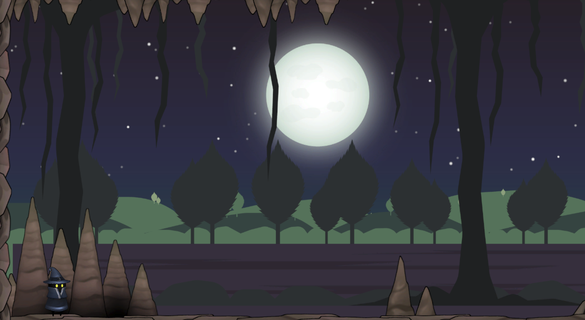

# Lunar Veil

A 2D platformer adventure where you explore mysterious caves, battle mobs, and uncover secrets in a world shrouded in twilight.



## Table of Contents
- [About](#about)
- [Features](#features)
- [Controls](#controls)
- [Installation](#installation)
- [How to Play](#how-to-play)

## About

**Lunar Veil** is a 2D platformer game built with Unity. You play as a mysterious wanderer navigating treacherous caves, avoiding deadly spikes, and fighting off hostile mobs. The game features atmospheric visuals, tight controls, and challenging platforming action.

## Features

- Atmospheric cave environments with parallax backgrounds
- Responsive 2D platformer controls
- Physics-based movement and interactions
- Enemy mobs to defeat
- Environmental hazards (spikes, pits, etc.)
- Dynamic color and state changes for the player character

## Controls

- **Move Left/Right:** `A` / `D` or `Left Arrow` / `Right Arrow`
- **Jump:** `Space`
- **Attack:** `Left Mouse Button` (if implemented)
- **Interact:** `E` (if implemented)

## Installation

1. **Clone the repository:**
   ```bash
   git clone https://github.com/stevend24/lunar-veil.git
   ```
2. **Open the project in Unity (recommended version: 2021.3 or later).**
3. **Press Play to start the game in the Unity Editor.**

## How to Play

- Navigate through the cave using the movement controls.
- Avoid spikes and other hazards.
- Defeat mobs to progress.
- Reach the end of each level to advance.

---
